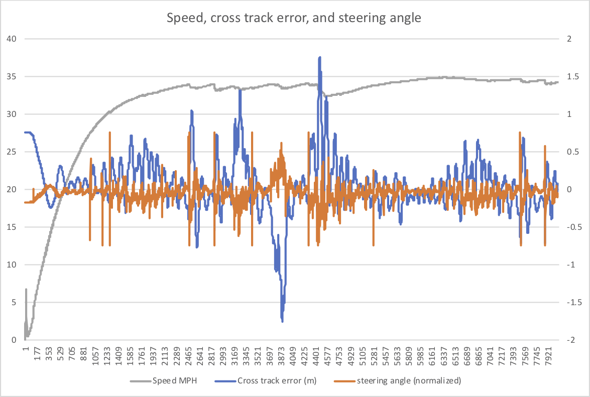

# CarND-Controls-PID
Self-Driving Car Engineer Nanodegree Program

Clark Hochgraf
June 29, 2020

# Demo video for Proportional only control (unstable)
https://youtu.be/fOUSFPqexw8

# Demo video for PID control (stable)
https://youtu.be/k12j5m8tlBc

# Graph Showing Performance of Control Loop 




# PROJECT SPECIFICATION: PID Controller


# Compilation

CRITERIA: Your code should compile.

:white_check_mark: MEETS SPECIFICATIONS: Code compiles without errors with cmake and make.

# Implementation

CRITERIA:  The PID procedure follows what was taught in the lessons.

:white_check_mark: MEETS SPECIFICATIONS: PID follows procedure from lessons. See attached source code.

# Reflection

CRITERIA:  Describe the effect each of the P, I, D components had in your implementation.

:white_check_mark:  MEETS SPECIFICATIONS: The proportional gain P does most of the work in creating the steering angle that brings the vehicle back to the center of the lane. The derivative gain D is essential in stabilizing the response of the steering. If the D gain is too low, the vehicle will oscillate around the center of the lane with increasing amplitude of oscillation, eventually leaving the road surface. With too high of a derivative gain, the controller actuator effort grows very large due to noise in the derivative signal. The I gain plays a smaller role in the control, correcting for long term errors in the steering angle e.g. due to a course that is consistently circling left or right. The behavior of each term P, I, and D is as expected.

:white_check_mark: MEETS SPECIFICATIONS: A video of the performance of the vehicle is given above. Also included is a plot of the cross track error, vehicle speed, and controller steering effort for one lap around the track.  

:white_check_mark:  MEETS SPECIFICATIONS: Describe how the final hyperparameters were chosen.

Tuning of the PID parameters was done manually and sequentially:
  - proportional gain was tuned to achieve initial action from the control loop
  - then derivative gain was added to stabilize the control loop, 
  - then iterative tuning of P and D gains to improve performance
  - finally a low value of integral gain was added to remove systematic errors

The final PID parameters were:
| Gain Term      | Value    |
|----------------|----------|
| P              | -0.25   |
| I              | -0.001  |
| D              | -5   |

# Simulation

CRITERIA: The vehicle must successfully drive a lap around the track.

:white_check_mark:  MEETS SPECIFICATIONS: No tire leaves the drivable portion of the track surface. The car does not pop up onto ledges or roll over any surfaces that would otherwise be considered unsafe (if humans were in the vehicle).


---

## Dependencies

* cmake >= 3.5
 * All OSes: [click here for installation instructions](https://cmake.org/install/)
* make >= 4.1(mac, linux), 3.81(Windows)
  * Linux: make is installed by default on most Linux distros
  * Mac: [install Xcode command line tools to get make](https://developer.apple.com/xcode/features/)
  * Windows: [Click here for installation instructions](http://gnuwin32.sourceforge.net/packages/make.htm)
* gcc/g++ >= 5.4
  * Linux: gcc / g++ is installed by default on most Linux distros
  * Mac: same deal as make - [install Xcode command line tools]((https://developer.apple.com/xcode/features/)
  * Windows: recommend using [MinGW](http://www.mingw.org/)
* [uWebSockets](https://github.com/uWebSockets/uWebSockets)
  * Run either `./install-mac.sh` or `./install-ubuntu.sh`.
  * If you install from source, checkout to commit `e94b6e1`, i.e.
    ```
    git clone https://github.com/uWebSockets/uWebSockets 
    cd uWebSockets
    git checkout e94b6e1
    ```
    Some function signatures have changed in v0.14.x. See [this PR](https://github.com/udacity/CarND-MPC-Project/pull/3) for more details.
* Simulator. You can download these from the [project intro page](https://github.com/udacity/self-driving-car-sim/releases) in the classroom.

Fellow students have put together a guide to Windows set-up for the project [here](https://s3-us-west-1.amazonaws.com/udacity-selfdrivingcar/files/Kidnapped_Vehicle_Windows_Setup.pdf) if the environment you have set up for the Sensor Fusion projects does not work for this project. There's also an experimental patch for windows in this [PR](https://github.com/udacity/CarND-PID-Control-Project/pull/3).

## Basic Build Instructions

1. Clone this repo.
2. Make a build directory: `mkdir build && cd build`
3. Compile: `cmake .. && make`
4. Run it: `./pid`. 

Tips for setting up your environment can be found [here](https://classroom.udacity.com/nanodegrees/nd013/parts/40f38239-66b6-46ec-ae68-03afd8a601c8/modules/0949fca6-b379-42af-a919-ee50aa304e6a/lessons/f758c44c-5e40-4e01-93b5-1a82aa4e044f/concepts/23d376c7-0195-4276-bdf0-e02f1f3c665d)
